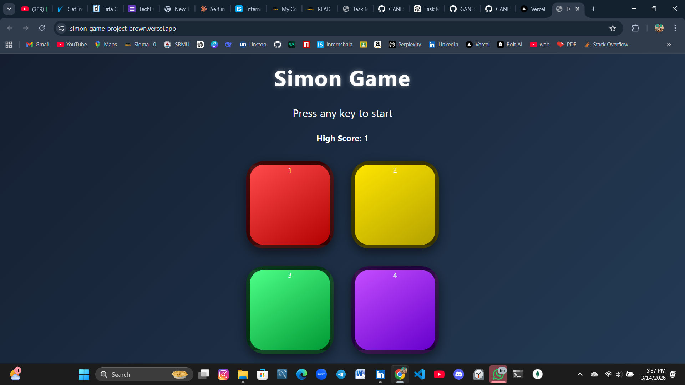

# Simon Says Game

A simple browser-based **Simon Says memory game** built using JavaScript.  
The game challenges players to remember and repeat an increasing sequence of colors.

## Live Demo
(Add your deployed link here if available)

## Features
- Interactive color buttons
- Increasing difficulty as the game progresses
- Score tracking based on level
- Visual and sound feedback for user actions
- Demonstrates DOM manipulation and event handling

## Technologies Used
- HTML
- CSS
- JavaScript

## How to Play
1. Press any key to start the game.
2. Watch the sequence of colors shown by the game.
3. Repeat the same sequence by clicking the color buttons.
4. The sequence increases with each level.
5. The game ends if the wrong button is clicked.

## Author
**Ganesh Verma**

## Screenshot

